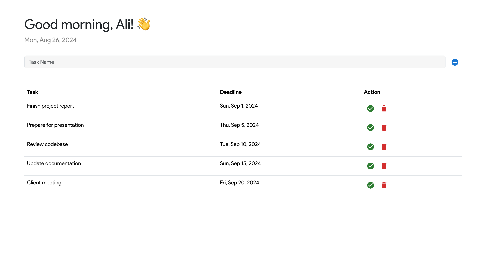

# Task Management App

A simple task management application built with React and Express. Users can add, view, and delete tasks, with deadlines formatted in a user-friendly manner.

## Screenshots

Home Screen:



## Features

- Add new tasks
- View list of tasks with deadlines
- Delete tasks
- Responsive design

## Technologies Used

- React
- Express
- Axios
- Bootstrap
- Material-UI

## Setup

### Prerequisites

- Node.js (v14 or later)
- npm (v6 or later)

### Installation

1. Clone the repository:

   ```bash
   git clone https://github.com/yourusername/your-repo.git
   cd your-repo
   ```

2. Install dependencies for the frontend:

   Navigate to the frontend directory (if applicable) and run:

   ```bash
   cd client
   npm install
   ```

3. Install dependencies for the backend:

   Navigate to the backend directory (if applicable) and run:

   ```bash
   cd server
   npm install
   ```

4. Set up environment variables:

   Create a `.env` file in the server directory with the following content:

   ```env
   PORT=8086
   ```

   Adjust the `PORT` value if necessary.

5. Start the development server:

   For the backend:

   ```bash
   cd server
   npm start
   ```

   For the frontend:

   ```bash
   cd client
   npm start
   ```

   The frontend will be available at [http://localhost:3000](http://localhost:3000), and the backend API will be available at [http://localhost:8086](http://localhost:8086).

## Usage

- Open the app in your browser at [http://localhost:3000](http://localhost:3000).
- Enter a task name in the input field and click the "Add" button to create a new task.
- The tasks will be displayed in a table with deadlines.
- Use the delete button to remove tasks.

## Contributing

Feel free to open an issue or submit a pull request if you have any improvements or suggestions!

## License

This project is licensed under the MIT License. See the LICENSE file for details.

## Notes

- Replace `https://github.com/yourusername/your-repo.git` with your actual repository URL.
- Update paths to screenshots according to your project's directory structure.
- Add any additional setup instructions or configuration details specific to your project.

Let me know if there's anything else you’d like to include!
